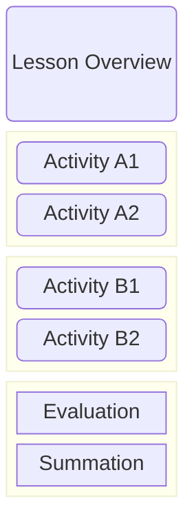

# Lesson Plans

Lesson plans are developed in Obsidian and broken into 15-30min blocks. The idea being that depending on the length of the lesson various blocks can be combined. Eg: If the lesson duration is 60min then 2-3 blocks of related material would be combined. 

Each block defines:

- Learning Outcomes
- Lesson Goals
- Assessment
    - Diagnostic
    - Formative
    - Summative

A full lesson plan would be:

